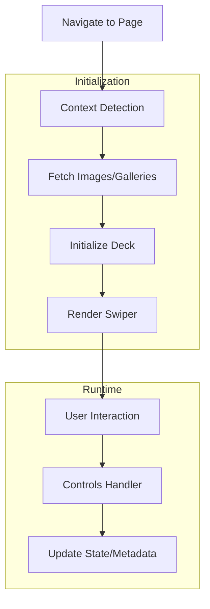

# Deck Viewer Plugin Architecture

## Overview

The Deck Viewer plugin provides an immersive slideshow experience for browsing images and galleries within Stash. It features advanced controls, metadata management, and dynamic loading capabilities.

## Project Structure

```
image-deck/
├── main.js          # Entry point and SPA navigation handling
├── ui.js           # UI initialization and component exports
├── button.js       # Launch button creation and management
├── deck.js         # Main deck functionality and Swiper integration
├── controls.js     # User interaction handlers (keyboard, mouse, touch)
├── swiper.js       # Swiper carousel configuration and initialization
├── metadata.js     # Metadata modal and GraphQL operations
├── graphql.js      # GraphQL API calls for image data manipulation
├── context.js      # Context detection and image fetching logic
├── config.js       # Plugin configuration and dynamic styling
├── utils.js        # Utility functions (mobile detection, image preloading)
└── build.js        # ESBuild configuration
```

## Component Architecture

### Main Entry Point (`main.js`)
- Initializes the plugin when DOM is ready
- Handles Single Page Application (SPA) navigation
- Cleans up deck instances on navigation changes

### UI Layer (`ui.js`, `button.js`)
**Responsibilities:**
- Creates and manages the launch button in navigation
- Monitors DOM changes to maintain button presence
- Initializes core UI components

**Key Features:**
- Dynamic button placement based on current page context
- Retry mechanism for button creation
- Cleanup on navigation

### Core Deck System (`deck.js`)
**Responsibilities:**
- Main orchestration of the Deck Viewer
- Context detection and image fetching
- Swiper initialization and lifecycle management
- Chunked loading for large collections

**Key Components:**
- **Context Detection**: Identifies current page type (single image, gallery, performer page, etc.)
- **Data Management**: Handles current images, pagination, and loading states
- **UI Creation**: Builds the complete deck interface
- **Lifecycle**: Manages opening/closing and cleanup

### Controls System (`controls.js`)
**Responsibilities:**
- Event handling for all user interactions
- Keyboard shortcuts and gesture recognition
- Fullscreen and UI state management

**Features:**
- **Keyboard Navigation**: Arrow keys, spacebar, escape, zoom controls
- **Touch Gestures**: Swipe-to-close, double-tap zoom
- **Mouse Support**: Wheel navigation, click handlers
- **Fullscreen Mode**: Container-based fullscreen implementation

### Swiper Integration (`swiper.js`)
**Responsibilities:**
- Configures and initializes Swiper carousel
- Handles slide templates for images and galleries
- Manages zoom functionality and visual effects

**Effects Supported:**
- Cards, Coverflow, Flip, Cube, Fade transitions
- Custom effect configurations
- Zoom with double-tap support

### Metadata Management (`metadata.js`, `graphql.js`)
**Responsibilities:**
- Image metadata viewing and editing
- GraphQL API communication
- Tag management and search

**Features:**
- Modal-based metadata interface
- Real-time rating system
- Tag addition/removal
- Bulk metadata updates

### Configuration System (`config.js`)
**Responsibilities:**
- Plugin setting management via GraphQL
- Dynamic CSS injection for styling
- Default value configuration

**Customizable Options:**
- Auto-play interval and transition effects
- UI elements (progress bar, counter)
- Visual effects (ambient lighting, glow)
- Performance settings (preload, chunk size)

### Context Detection (`context.js`)
**Responsibilities:**
- Page context analysis and classification
- Image/Gallery data fetching from GraphQL
- URL parameter parsing

**Context Types:**
- Single image/gallery view
- Listing pages (images, galleries, performers)
- Filtered views with complex queries
- Exclusion-based filtering support

### Utilities (`utils.js`)
**Responsibilities:**
- Mobile device detection
- Image preloading and caching
- Performance optimization helpers

## Data Flow



## Key Architectural Patterns

### Modular Design
- Each file handles a specific concern
- Clear separation between UI, logic, and data layers
- ES6 module imports for dependency management

### Event-Driven Architecture
- DOM event listeners for user interactions
- Custom event handling for internal communication
- Cleanup functions for memory management

### Lazy Loading & Performance
- Chunked data loading for large collections
- Image preloading with caching
- Virtual slides for smooth performance

### Responsive Design
- Mobile-optimized controls and layouts
- Touch gesture support
- Adaptive UI based on screen size

## Plugin Integration Points

### GraphQL API Usage
- Image metadata fetching and updating
- Tag management and search
- Context-aware data querying

### Stash Interface Integration
- Navigation menu button placement
- SPA navigation awareness
- Existing UI element detection

### Customization Hooks
- Configurable settings via plugin interface
- Dynamic styling through CSS variables
- Extensible effect system

## Development Considerations

### For Future Developers

1. **State Management**: The plugin uses global references (`window.currentSwiperInstance`) for sharing state between modules
2. **Memory Management**: Always clean up event listeners and intervals in cleanup functions
3. **Performance**: Large collections use virtual slides and chunked loading
4. **Mobile Support**: Touch events and mobile-optimized layouts are critical
5. **Error Handling**: Graceful degradation when GraphQL requests fail

### Extension Points

- New transition effects can be added to `swiper.js`
- Additional metadata fields can be integrated into `metadata.js`
- Custom controls can be added to `controls.js`
- New context types can be detected in `context.js`

This architecture provides a robust foundation for an immersive image browsing experience while maintaining flexibility for future enhancements.